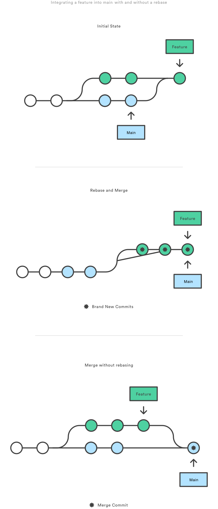

# Code reviews

## Git: Merge vs Rebase

When multiple people work on a single git repo, often two diverged branches need to be combined into one.



Very detailed merge vs rebase explanation https://www.atlassian.com/git/tutorials/merging-vs-rebasing

Tools that visualize the repo graph:

- [Sublime Merge](https://www.sublimemerge.com) - free for evaluation, supports Linux
- [Sourcetree](https://www.sourcetreeapp.com) - free
- [Fork](https://git-fork.com) - free for evaluation 

## GitHub pull request

A pull request provides a workflow for collaborating with team members. This workflow includes code reviews. 

Basic workflow is:

1. Create a branch
2. Make changes and commit
3. Push to GitHub
4. Create a pull request
5. Once all checks pass merge the pull request

https://docs.github.com/en/github/collaborating-with-pull-requests/proposing-changes-to-your-work-with-pull-requests/about-pull-requests


## Code reviews

Code reviews are an easy way to increase the collaboration and code quality within a team.

Some of the benefits are:

* bugs/issues are detected very early
* good practices are shared with more members inside a team
* more team members are familiar with the new code

Google offers a [code review guidelines](https://google.github.io/eng-practices/review/reviewer/). 

## Django queries

The RAW Django queries can be seen by enabling logging in a shell:

```python
import logging
l = logging.getLogger('django.db.backends')
l.setLevel(logging.DEBUG)
l.addHandler(logging.StreamHandler())
```

After that if queries are executed the raw SQL is outputted to the stdout:

```python
>>> Currency.objects.all()
(0.000) SELECT "crypto_currency"."id", "crypto_currency"."name", "crypto_currency"."price", "crypto_currency"."code", "crypto_currency"."supply" FROM "crypto_currency" LIMIT 21; args=()
```

This allows checking what queries are executed and if they are "good enough".