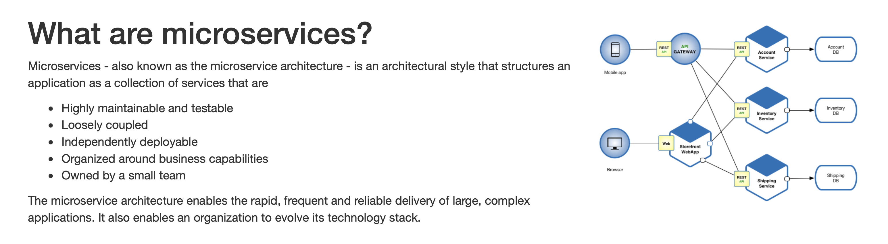
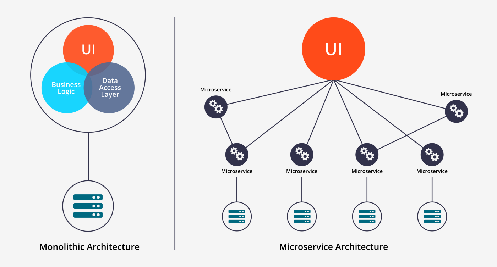

# Microservices archirecture

## Traditional monolith architecture

In a traditional monolith every part of the application/system is located in a single package. Often this is the frontend, backend, db, etc. 

## Microservices vs monolith

Here are a few comparisons between the two:

* https://www.clickittech.com/devops/microservices-vs-monolith/
* https://www.geeksforgeeks.org/monolithic-vs-microservices-architecture/

## Example

In a simple online store the following components can be separated into smaller parts:

* user authorization
* store logic (business logic of the website)
* payment
* email updates/notifications
* customer support

If those were structured as a monolith changes to the payment subsystem would potentially affect the unrelated email subsystem. None of them would be able to be updated independently.
