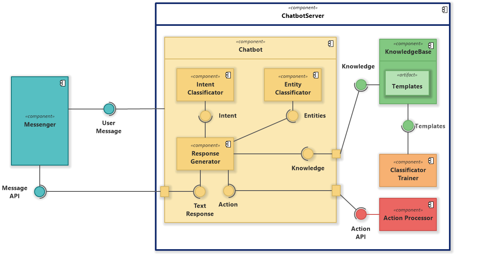
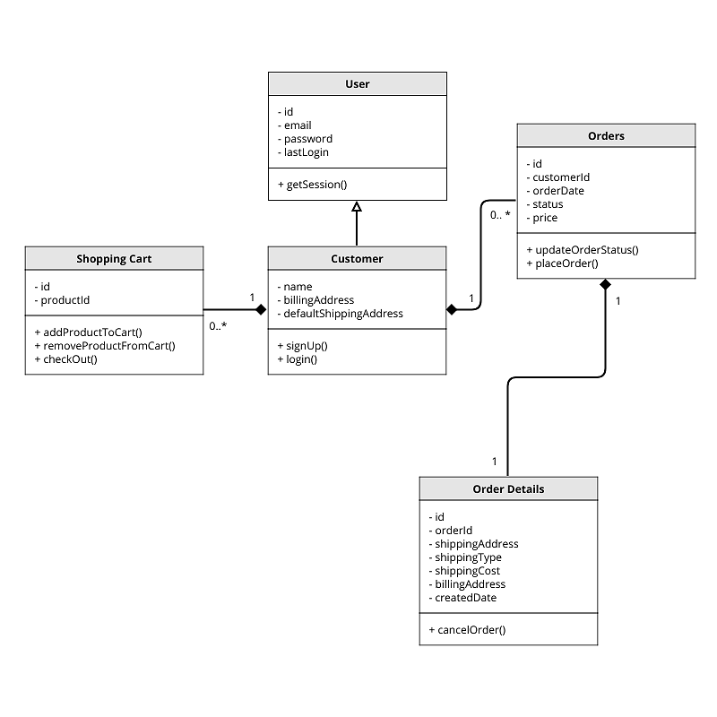
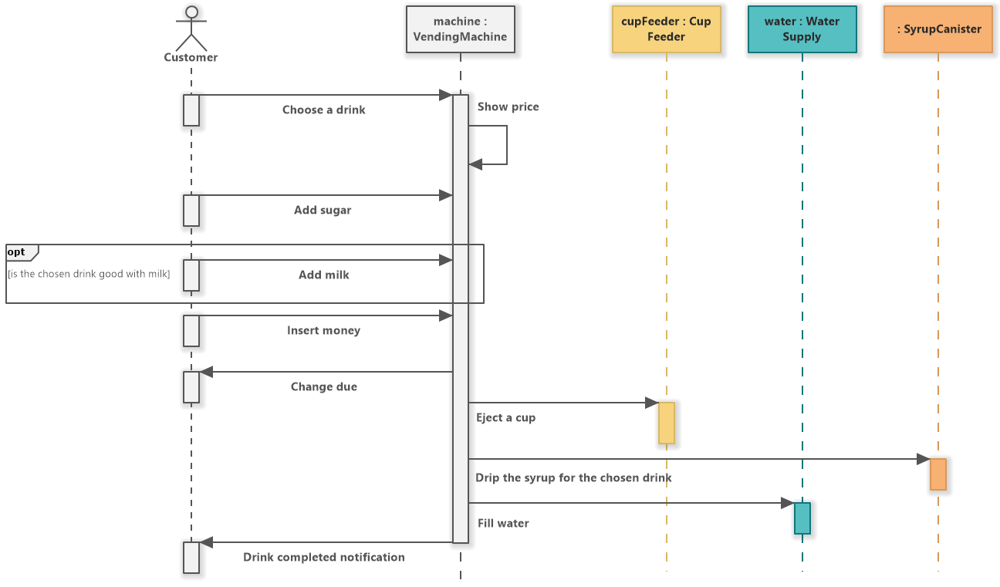
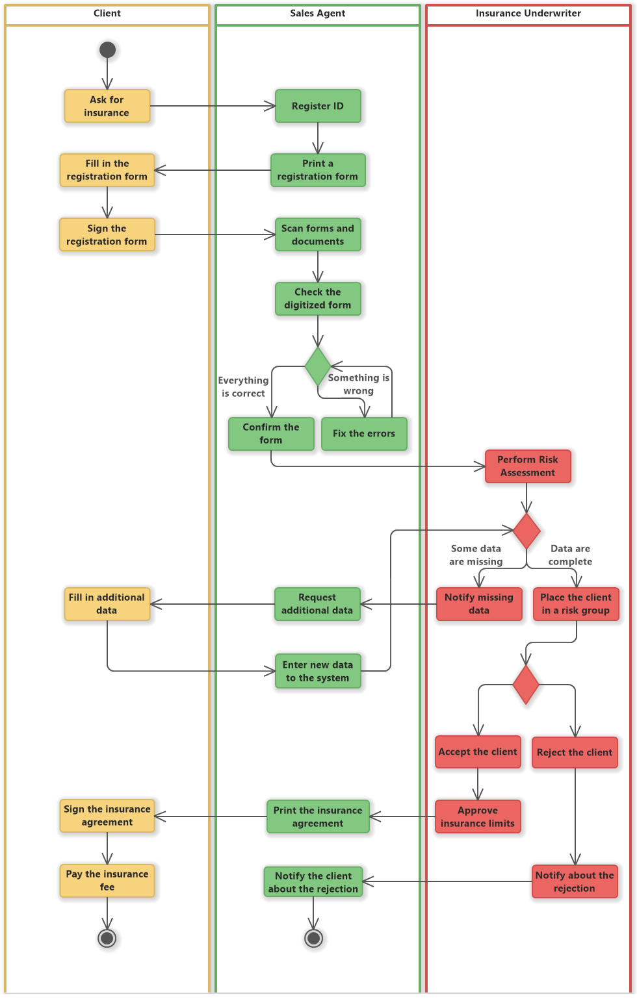
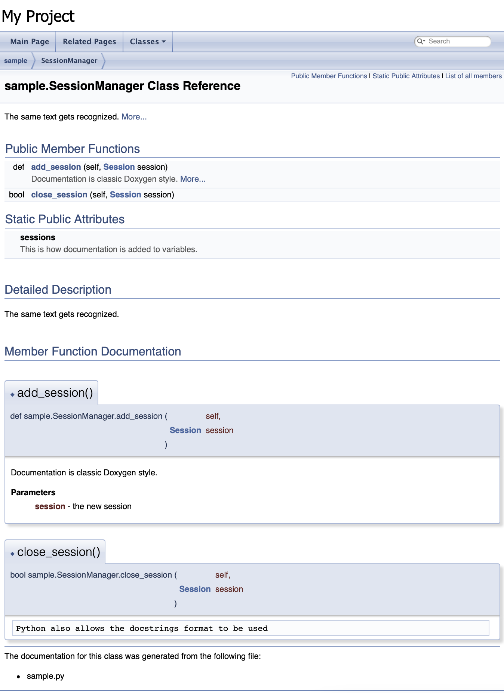
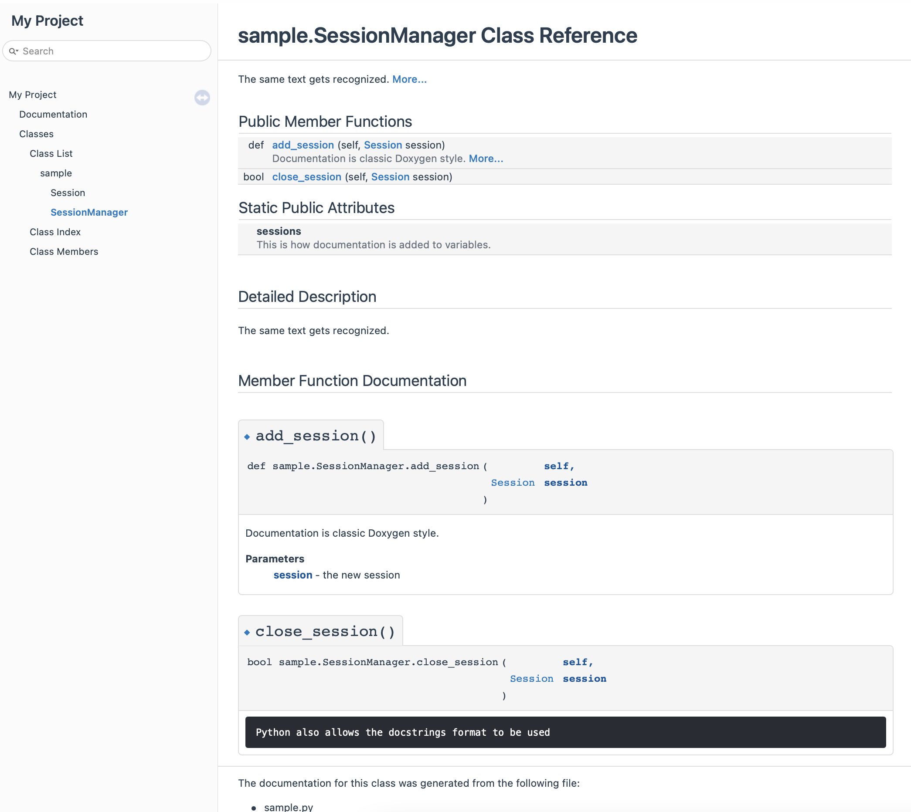

# Documentation

Documentation for a project usually consists of many different documents/images/guides/requirements. 

Common places to find where to find a documentation:

* source code - as comments of classes, functions
* GitHub - hosted on docs
* README files - included in the package
* man pages - included in linux
* reference website - online

## Types of documentation


* Design documentation - technical explanation showing how the product should work. It often includes UML diagrams like class/sequence/activity/deployment diagrams. It explains what technologies are used and why.
* Requirements / Specification - how the product should function and what features it should have. This includes UI/UX flows and written requirements. A requirement is called a feature, functionality, behavior, limitation that the system should have.
* User documentation - manual on how to use the product. This part is intended for the end-user/consumer of the product. It includes tutorials, how to guides, api references, etc.

Often the user documentation has parts of the Design and Specification. This is to give a better high level understanding of how the product works.

## UML diagrams

Unified Modeling Language (UML) is a standard that defines how a system/product should be described. Usually the standard is not followed strictly and the end diagrams air for readability instead.

### Component diagram

The component diagram describes how a software system is split up into components and shows the dependencies among these components.



### Class diagram

The class diagram describes how each class in the system interacts with the other classes.



### Sequence diagram

The sequence diagram shows how objects communicate with each other regarding a sequence of messages.



### Activity diagram

The activity diagram describes the business and operational step-by-step activities of the components in a system.



More sample UML diagrams can be found at: https://www.softwareideas.net/c/1058/UML

## API reference

This includes a short description how each function, method, class, API endpoint works. In explains what input it expects and what returns as output.

Those are generated by tools.

Some examples:

* https://developer.apple.com/documentation/musickitjs/musickit/musickitinstance
* https://developers.google.com/youtube/v3/docs
* https://docs.python.org/3/library/os.path.html
* https://api-v3.mbta.com/docs/swagger/index.html

## Doxygen demo

[Doxygen](https://www.doxygen.nl/index.html) is a tool that allows API Reference documentation to be easily generated from comments in the code.

The benefit of this is that this makes the API reference documentation easier to maintain.

The comments need to be in a style that is recognized by the tool. For example for c/c++/java style comments this looks like:

```c++
/**
 * @brief A quick description of what the function does
 *
 * @param name Description of the first parameter
 * 
 * @return Description of the return value
 */
int function(string name) {
    // ...
}
```

For Python the following style can be used:

```python
##
# @brief The same text gets recognized 
class SessionManager:


    ## This is how documentation is added to variables
    self.sessions = []

    ## 
    # @brief Documentation is classic Doxygen style
    #
    # @param session - the new session
    def add_session(self, session: Session):
        pass
    
    def close_session(self, session: Session) -> bool:
        """
        Python also allows the docstrings format to be used
        """
        pass
```

Such comments are places before every method, function, type and class. 

To generate a documentation execute `doxygen -g`. This will create a default config file. Running `doxygen` will generate html from all source files in the current directory.

```bash
$ doxygen -g


Configuration file 'Doxyfile' created.

Now edit the configuration file and enter

  doxygen

to generate the documentation for your project

$ doxygen 

Doxygen version used: 1.9.2
Searching for include files...
...
Generating page index...
...
```

This will produce the following:



The generated html can easily be stylized. For example applying [Doxygen Awesome](https://github.com/jothepro/doxygen-awesome-css) would produce:


