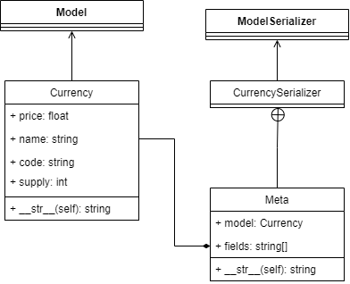
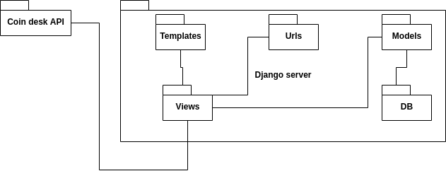
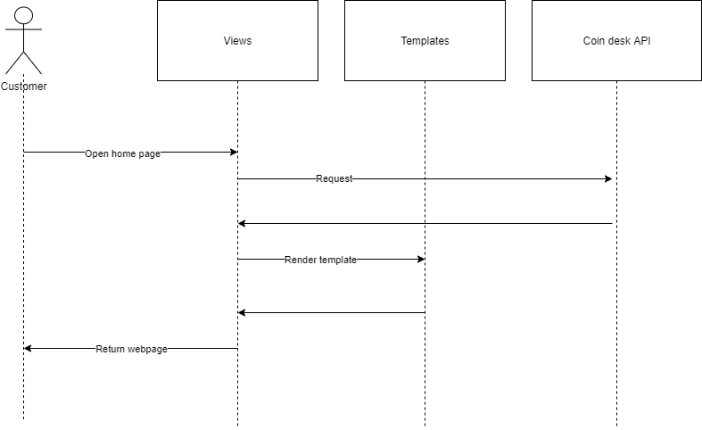

# UML diagrams

The following diagrams are part of the exercise from class.

## Class diagram

Shows the classes and their relations in the Crypto project.

## Component diagram

Shows the structure of the crypto project.

## Sequence diagram

Shows the flow when loading the home web page.

