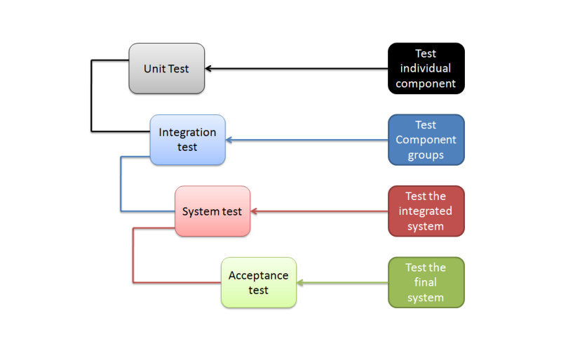
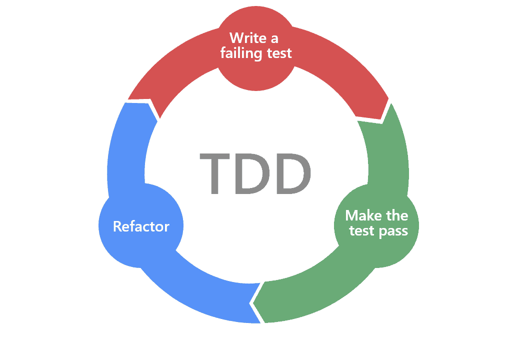

# Testing

## Why testing software?

Testing is to make sure the software works as expected. There are different kinds of testing basen on who does it, what does it test and what does it test.

## Manual vs Automation 

* Manual Testing - usually performed by Manual QA. During development any time the developer runs the code and manually enters data can also be added to this category.
* Automated Testing - usually performed by Automation QA or Developer in the form of unit tests or other automated script.

## Scope of the tests

* Unit Testing - Tests a single unit (also called a class) that it works correctly
* Integration Testing - Two or more units (components) and how they interact together (This could be saving and reading from database using a high level model wrapper)
* System Testing - Tests the whole system (usually isolated)
* Acceptance Testing - Tests the final production system



## What does it test?

* Functional Testing - Checks if the product covers the specification. Usually such tests answer the question of "can the user do this" or "does this particular feature work."
* Non-functional Testing - Everything else not related to user action
    * Security Testing - Is X secured from hackers?
    * Performance Testing - Can X so this in Y amount of time?
    * Reliability Testing - Can the system work without X?
    * Durability Testing - Can it handle a peak load of X?


## White and black box

* White-box testing - White-box testing verifies the internal structures of a program work as expected. In white-box testing, the source code of the system is used to design test cases.
* Black-box testing - Black-box testing treats the software as a "black box", examining functionality without any knowledge of structures and algorithms, without seeing the source code. The testers are only aware of what the software is supposed to do, not how it does it.


## Code coverage

Code coverage is a common metric of evaluating a white box testing method. Usually unit tests are written until the desired coverage is achieved.

Covering lines means that during execution of the test at least once the line was hit by the test.

Covering branching means that during execution of the test every if / switch was visited in all of his cases.


## Test Driven Development

Test Driven Development (TDD) is a method of writing software that requires tests to be written before teh actual code.

The benefits of this approach is that running the product to verify that it works is usually completely eliminated.



# Off topic

## Stable vs unstable sorting

Lets check the following array of elements:

```
[ <Chair normal 4>, <Chair soft 4>, <Chair old 3>, <Chair office 6> ]
```

Each chair consists of name and number of legs.

If we sort with number of legs in ascending order we would end up with:

```
[ <Chair old 3>, <Chair normal 4>, <Chair soft 4>,  <Chair office 6> ] - (1)
[ <Chair old 3>, <Chair soft 4>, <Chair normal 4>,  <Chair office 6> ] - (2)
```

If the sorting is **guaranteed** to end in (1) the algorithm is **stable** - order of `normal` and `soft` is preserved as in the original unsorted array.

If the sorting ends up in either (1) or (2) the algorithm is **unstable** - the order of `normal` and `soft` may not be preserved. 

Note we would consider `normal` and `soft` equal when sorting. They both have 4 legs.


Examples:

* Stable sorting algorithms - bubble sort, merge sort
* Unstable sorting algorithms - quick sort