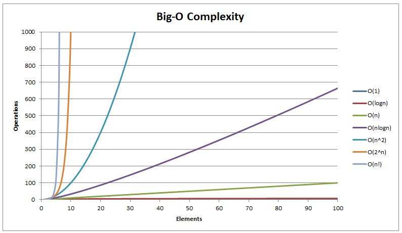

# Code time and space complexity

Code space and time complexity is a measurement of how an algorithm performs if the input data gets larger.

[Time complexity](https://en.wikipedia.org/wiki/Time_complexity) is a measurement of how much execution time grow with more data, while space complexity is a measurement of how memory usage grows with more data.


## Big O notation

The [Big O notation](https://en.wikipedia.org/wiki/Big_O_notation) is the most common metric of an algorithm. It is the worst case(upper limit) an algorithm can perform. 

There are other notations for evaluating the average and best case of an algorithm.

## Common functions used to describe growth rate


Big-O growth:



Usually the following orders of functions are used:

* `O(1)` - const - the time is the same regardless of input size
  * search in hash table
* `O(log n)` - logarithmic - very slow growth
  * binary search, balanced tree operations
* `O(n)` - linear
  * search in array, any algorithm that iterates once over all elements
  * ```
    for index in range(n):
        e = elements[index]
        ...
    ```
* `O(n log n)` 
  * merge sort, heap sort
* `O(n^2)` - quadratic - fast pace of growth
  * bubble sort, any algorithm that iterates over **every** element n times
  * ```
    for i in range(n):
        for j in range(n):
            ...
    ```
* `O(2^n)` - exponential
  * recursive fibonacci calculation
  * finding the best solution of [travelling salesman problem](https://en.wikipedia.org/wiki/Travelling_salesman_problem)
* `O(n!)`
  * brute force of travelling salesman problem

`n` is the size of the input. Differences are measured for very big `n` numbers.

Comparison of sorting algorithms:


## Time or Space optimization

This is referred to as [Space-Time tradeoff](https://en.wikipedia.org/wiki/Space–time_tradeoff). Usually multiple algorithm are available for solving the same problem. Depending on the use case either time or space could be optimized, but not both.

Example swap of two numbers:

```
# time optimized - fastest time 
swap(a, b):
    c = a
    a = b
    b = c
```

*Uses more memory but fastest - 1 extra memory, 3 assign operations*


```
# space optimized - lowest memory usage
swap(a, b):
    a = a + b
    b = a - b
    a = a - b
```

*Uses least memory but slower - 0 extra memory, 3 assign operations + 3 arithmetic operations*