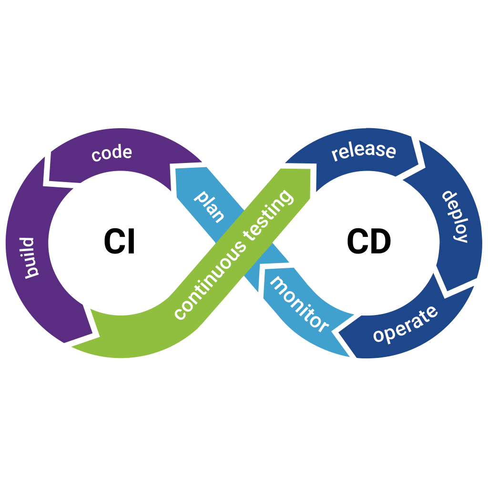

# Continuous Integration / Continuous Delivery




The goal of CI/CD is to have stable foundation to build code upon. A good CI/CD workflow will reduce leaking buggy code and regressions significantly.

Further reading: https://docs.gitlab.com/ee/ci/introduction/

# GitHub Actions

[GitHub Actions](https://github.com/features/actions) is the automation solution integrated in GitHub that could be used for Continuous Integration and Continuous Delivery (or Deployment).

GitHub actions are written in YAML format and stored in under `.github/workflows`

```yaml
name: First CI

# Controls when the workflow will run
on:
  # Triggers the workflow on push or pull request events but only for the main branch, if changes under 21_ci_cd folder are made
  push:
    branches: [ main ]
    paths: 
      - 21_ci_cd/**
  pull_request:
    branches: [ main ]
    paths: 
      - 21_ci_cd/**

  # Allows you to run this workflow manually from the Actions tab
  workflow_dispatch:

# A workflow run is made up of one or more jobs that can run sequentially or in parallel
jobs:
  # This workflow contains a single job called "build"
  build:
    # The type of runner that the job will run on
    runs-on: ubuntu-latest

    # Steps represent a sequence of tasks that will be executed as part of the job
    steps:
      # Checks-out your repository under $GITHUB_WORKSPACE, so your job can access it
      - uses: actions/checkout@v2

      # Runs a single command using the runners shell
      - name: Ensure that file is sorted
        run: sort --numeric-sort --check=quiet 21_ci_cd/sorted.txt 
```