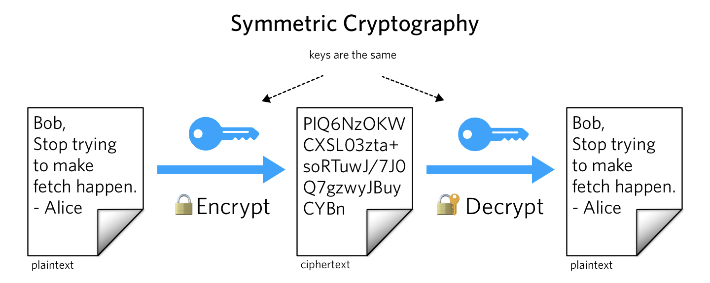
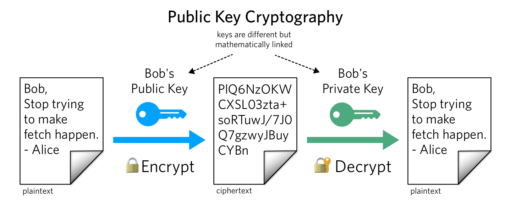
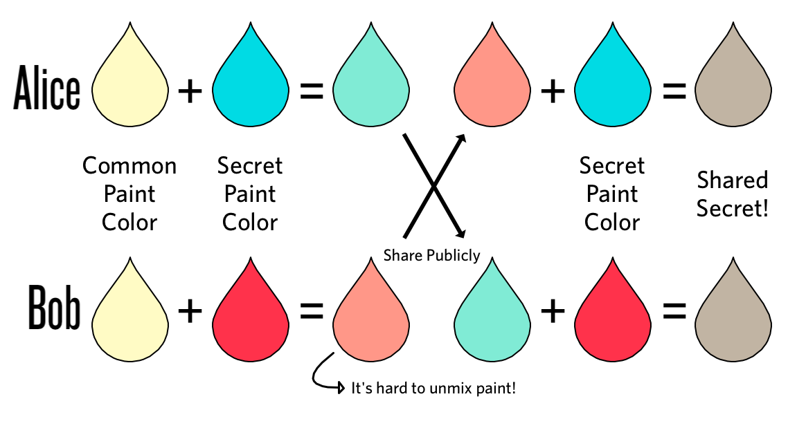

# Cryptography

## Encryption & Decryption

**Encryption** is the process of converting a plain text (or file) into unreadable text (file) which cannot be read without reversing the process. 

**Decryption** is the inverse process - converting the unreadable text (file) back into readable text (file.)

### Symmertic Algorithm

The same key is used for encryption and decryption.

Commonly used algorithms: [AES](https://en.wikipedia.org/wiki/Advanced_Encryption_Standard), [DES](https://en.wikipedia.org/wiki/Data_Encryption_Standard), [3DES](https://en.wikipedia.org/wiki/Triple_DES)

### Asymmertic Algorithm

Two keys exist that are the opposite of one another. One is used for encryption and the other for decryption. Also called public key cryptography due to the fact that one key is called public and the other private.

Exmaples: [RSA](https://en.wikipedia.org/wiki/Advanced_Encryption_Standard)

Resources:
  * https://www.twilio.com/blog/what-is-public-key-cryptography
  * [Public Key Cryptography - YouTube](https://www.youtube.com/watch?v=GSIDS_lvRv4)
  * [Key Exchange Problems - YouTube](https://www.youtube.com/watch?v=vsXMMT2CqqE)

  ## Diffie–Hellman algorithm

  [Diffie-Hellman](https://en.wikipedia.org/wiki/Diffie–Hellman_key_exchange) is an algorithm for secret key exchange. This allows two parties to share a common encryption key without having a secure channel.

  

Resources:
    * [Diffie Hellman - YouTube](https://www.youtube.com/watch?v=NmM9HA2MQGI)
    * [Key Exchange Problems - YouTube](https://www.youtube.com/watch?v=vsXMMT2CqqE)