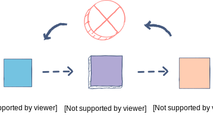
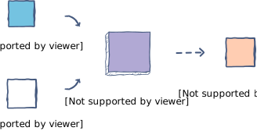

# Hashing

Simple functions that could be used as hash function:

* XOR - operation by bytes
* MOD - division with remainder

## Collisions

Cryptographic hash functions reduce the change of collisions and eliminate generating key that generates a specific hash.

Cryptographic hash functions:

* MD5
* SHA-1 

Resources:

* https://www.educative.io/edpresso/what-is-hashing
* https://searchsqlserver.techtarget.com/definition/hashing
