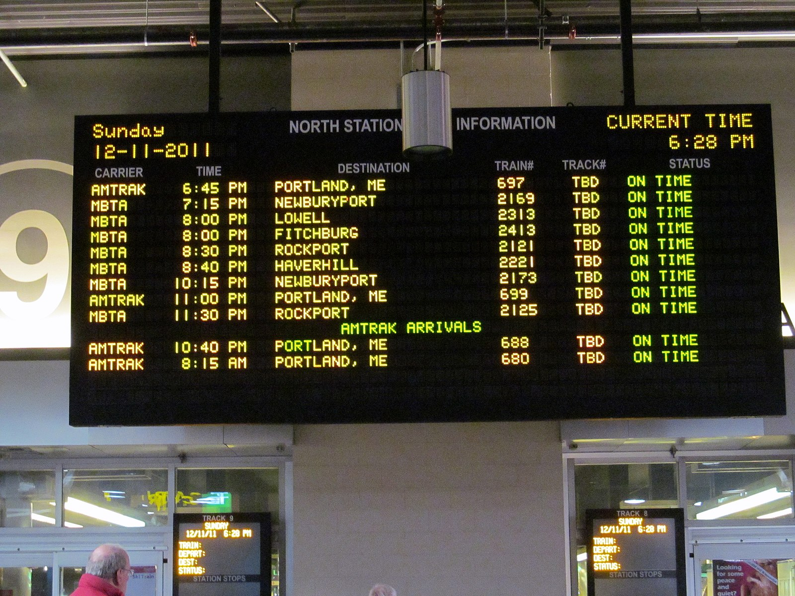

# Train station departure board



## MBTA REST API

Massachusetts Bay Transportation Authority (MBTA) provides a public REST API.

The API reference can be found [here](https://www.mbta.com/developers/v3-api).

For experimentation there is a [swagger](https://api-v3.mbta.com/docs/swagger/index.html) page.

## Create a departure board

Use the predictions API: 

```
https://api-v3.mbta.com/predictions?page%5Boffset%5D=0&page%5Blimit%5D=10&sort=-departure_time&filter%5Bstop%5D=place-north
```

Notes:

* The `prediction` object shows the actual time or arrival and status
* The `schedule` object shows the planned time
* Use the `vehicle` object to get some of the train information like number, destination, etc.
* You will need to manually map each `prediction` with the `vehicle` and `schedule` objects via their IDs

## Where to upload the homework?

Create a app named `xx_firstname_lastname` the current django project (`homework_02`) where:
- `xx` is your number in class
- `firstname` is your first name
- `lastname` is your last/family name

Example: 05_ivan_ivanov

When running the server and accessing it via the following url it should display the departure board.

Example: localhost:8000/05/ should open a page with the departure board

Important: Create a pull request with the changes to allow others to review the changes. Do not merge the PR before the code review deadline.

## Code reviews

TBD: assign reviewers

Try to show things that can be improved in the code, but also note the parts that you like. Aim at giving a balanced code review - state both the parts that are good and those that may be improved.

## Deadline

Uploading the homework:

```
Sun, 24 Oct 2021 23:59:59 +0300
```

Doing the code reviews:

```
Tue, 26 Oct 2021 23:59:59 +0300
```