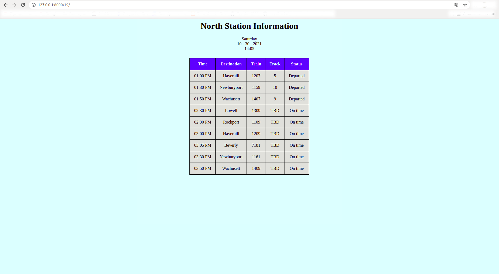

# Installation Instructions

The new project can be created via the next command:

```
python3 manage.py startapp teodor_dishanski_19
```

This command will create a new folder in the current project. This will be the new app.

An example image of the development of the *Train Station Departure Board*:


