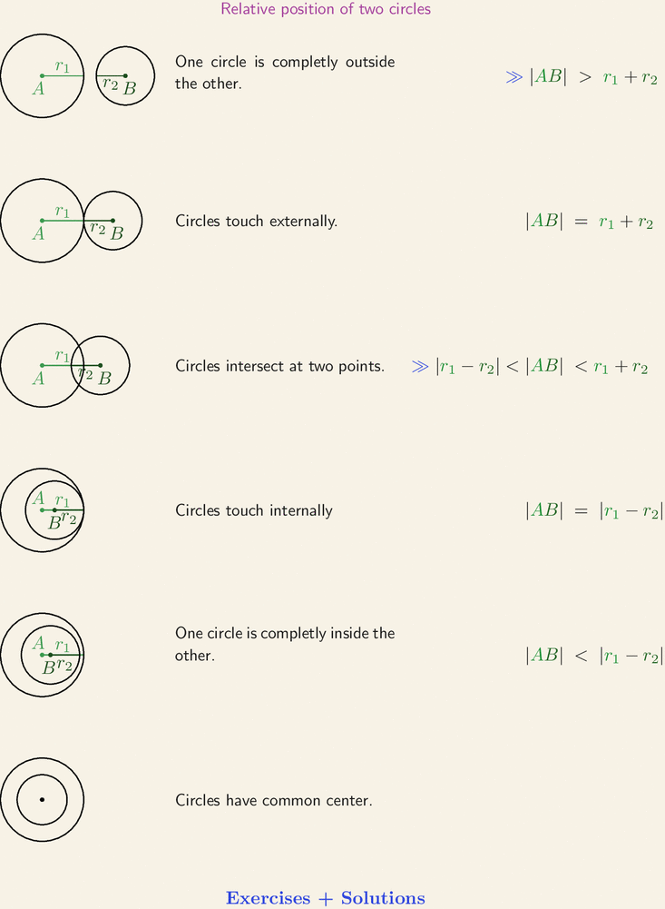

# Unit tests

## Задача

Клас `Point`, описваща точка в декартова координатна система с координати `x` и `y` от тип `float`, и клас `Circle`, описваща окръжност с център center от тип Point и радиус `r` от тип `float`.
Да напише метод `find_relative_position` на класа `Circle`, която определя относителната позиция на две дадени окръжности една спрямо друга. Резултатът от изпълнението на функцията е стойност от изброения тип(enum): `RelativePosition` {`NO_COMMON_POINTS`, `TOUCHING`, `INTERSECTING`, `SAME`} със следния смисъл:

* `NO_COMMON_POINTS`: без общи точки
* `TOUCHING`: допиращи се
* `INTERSECTING`: пресичащи се
* `SAME`: съвпадат - всички точки от едната са и от другата



## Тестове

Направете тестове така че да покриват 100% от кода на метода `find_relative_position`.

## Where to upload the homework?

Create a folder named `xx_firstname_lastname` the current folder (`homework_02`) where:
- `xx` is your number in class
- `firstname` is your first name
- `lastname` is your last/family name

Example: 05_ivan_ivanov

All unit tests should pass when ran like: `pytest`.

## Code reviews

| Student| Reviewer 1 | Reviewer 2|
|-------|------------|-----------|
| Alexander1022 |  Martincho2003 | marto55 |
| AngelStoyanov33 |  mvvrachev | Ivan-Enchev |
| atanasatanasov03 |  Vladikolev0321 | Alexander1022 |
| Vic-Dim | DeniBademi | elizadamgova |
| Vicktoria853 |  Teodor1331 | mvvrachev |
| Vladikolev0321 |  petardmnv | StelianRBG |
| GerganaRoeva |  marto55 | DeniBademi |
| DeniBademi |  StelianRBG | Vic-Dim |
| elizadamgova |  GerganaRoeva | VayerMaking |
| Ivan-Enchev | elizadamgova | Martincho2003 |
| Lilly7777 |  atanasatanasov03 | Vicktoria853 |
| mvvrachev |  VayerMaking | petardmnv |
| marto55 |  Lilly7777 | GerganaRoeva |
| marti456 |  Alexander1022 | Teodor1331 |
| Martincho2003 |  marti456 | Vladikolev0321 |
| VayerMaking |  Ivan-Enchev | marti456 |
| petardmnv |  Vic-Dim | Lilly7777 |
| StelianRBG |  Vicktoria853 | AngelStoyanov33 |
| Teodor1331 |  AngelStoyanov33 | atanasatanasov03 |

## Deadline

Uploading the homework:

```
Tue, 30 Nov 2021 23:59:59 +0300
```

Doing the code reviews:

```
Fri, 03 Dec 2021 23:59:59 +0300
```

Merge the pull request:

```
Sun, 05 Dec 2021 23:59:59 +0300
```