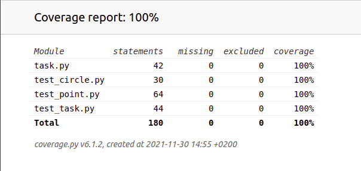
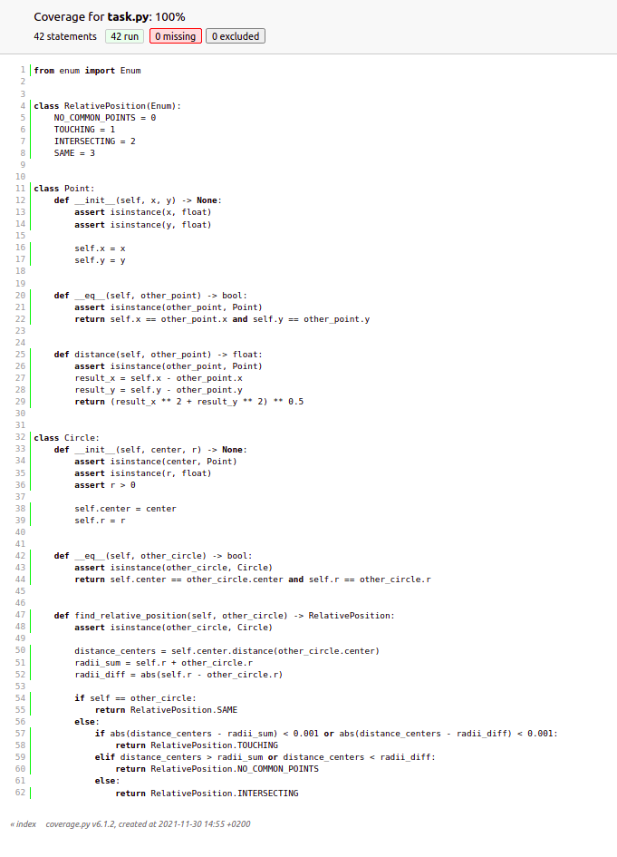
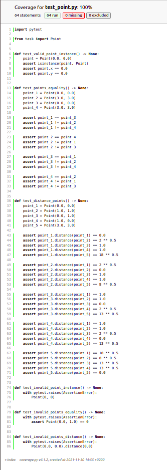
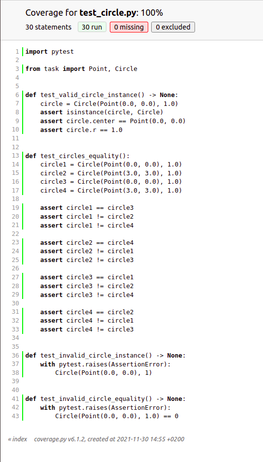
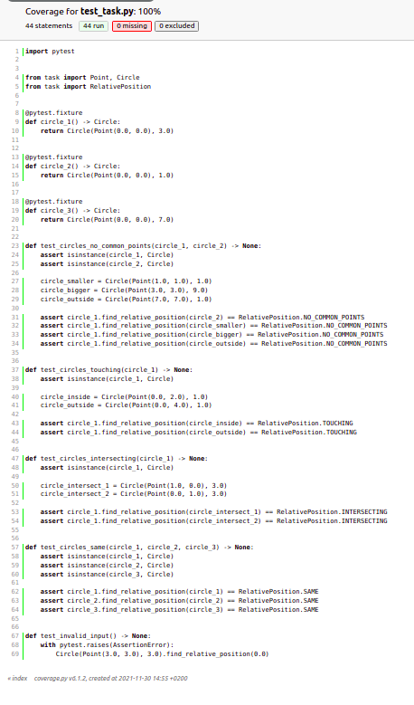

# **Instructions**

To run the tests in the command line and to receive the coverage report from the running, you should type directly in the folder the command:

```
coverage run -m pytest
```

After this, in order to see the coverage report in HTML documents, your should run the command:

```
coverage html
```

We do not need to write our test files as arguments in the upper two commands, because PyTest framework will automatically find them by the *test_some_name.py* naming. You can visualize for yourself from the *index.html* file that the tests have checked 100 % of the code in our program.

I have splitted the different tests in three main categories - tests that test only the *Point* class, tests that test only the *Circle* class and tests that test the logic of the *find_relative_position* method.

<p align="center" width="100%">
    <br></br>
    <br></br>
    <br></br>
    <br></br>
    <br></br>
</p>
